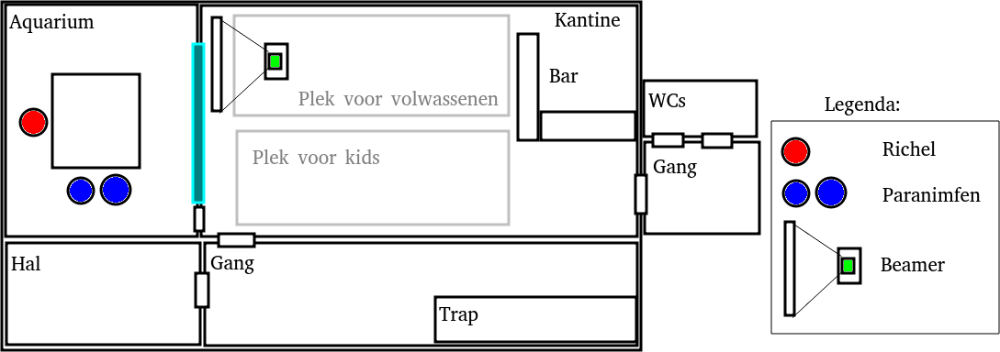

# phd_defense

My PhD defense.

 * Date: September 18, 2020
 * Time: 16:15 to approx 17:15
 * Videostream of defense at [https://www.rug.nl/digitalphd](https://www.rug.nl/digitalphd)
 * Location: De Jonge Onderzoekers, Dirk Huizingastraat 13

Time       |What                 
-----------|---------------------
15:00-15:15|Doors are open       
15:15-15:45|Layman talk          
15:45-16:15|Doors are open, break
16:15-17:15|PhD defense          
17:15-18:00|Congratulations      

## Evening program

Beer at somewhere, starting from 20:00,
at a location to be decided by the beernymphs.

## Full schedule

This includes different roles

Time       |What                 |Who                  |Where
-----------|---------------------|---------------------|---------------------------------------------
14:00-15:00|Preparation          |Richel and volunteers|DJO
15:00-15:15|Doors are open       |Everyone             |DJO
15:15-15:45|Layman talk          |Everyone             |DJO
15:45-16:15|Break                |Guests               |DJO
.          |Preparation          |Richel and paranymphs|DJO
16:15-17:15|PhD defense          |Everyone             |DJO
17:15-18:00|Congratulations      |Everyone             |DJO
18:00-20:00|Family dinner        |Family               |A top-secret location
20:00-??:??|Beer!                |Adults               |Unknown yet, decided by beernymphs

## Kaart

## Paranymph list

Rank| Name   | Confirmed
----|--------|----------
  1 | Mart   | As good as
  2 | Rohan  | Not yet
  3 | Bruno  | Not yet
  4 | Maksim | Not yet
  5 | Jasper | Not yet
  6 | Quinn  | Not yet
  7 | Jacob  | Not yet
  8 | Seb    | Not yet
  9 | Jesper | Not yet
 10 | Oliver | Not yet

## (NL) Wat doet een paranimf?

Een paranimf is een sjiek gekleed persoon met een plechtige taak,
zoals een bruidsjonker/bruidsmeisje op een bruiloft.
Zie ook [op Wikipedia](https://nl.wikipedia.org/wiki/Paranimf).

Tijdens een promotie zijn er twee paranimfen.

Tijdens de verdediging, zit Richel en de twee paranimfen in
het Aquarium/Fijnmetaallokaal. Daar is een camera, namelijk
die van Richel's laptop. Als een opponent vraagt een stelling ('proposition')
uit het proefschrift voor te lezen, 
gaat Richel uit beeld en mag een paranimf voor de camera een stelling voorlezen.
Daarna mag hij/zij weer uit beeld en Richel in beeld.

Het kan zijn dat een paranimf geen stelling voor mag lezen, 
want dat hangt af van de professoren. De eerste stelling
wordt door de eerst gekozen paranimf voorgelezen.
De zeven stellingen kun je [hier](https://github.com/richelbilderbeek/thesis_propositions/blob/master/propositions.tex#L54)
lezen (een paranimf hoeft de stellingen niet te snappen :grin::+1:).

## Beernymphs

 * Alexine
 * Sjors
 * Paranymphs

## Volunteers

 * Bruno
 * Jacob
 * Jasper
 * Jesper
 * Jonas
 * Mart
 * Oliver
 * Quinn
 * Rohan
 * Seb
 * (another one, see Teaching logbook)

## (NL) Wat doet een vrijwilliger?

Een vrijwilliger helpt met het opbouwen van de ruimte,
ontvangt de gasten, verzorgt de gasten, geeft rondleidingen op verzoek.

## Misc

 * My thesis: [http://richelbilderbeek.nl/thesis.pdf](http://richelbilderbeek.nl/thesis.pdf)
 * [RuG announcement](https://www.rug.nl/about-ug/latest-news/events/promoties/promoties-2020?hfId=118284)

