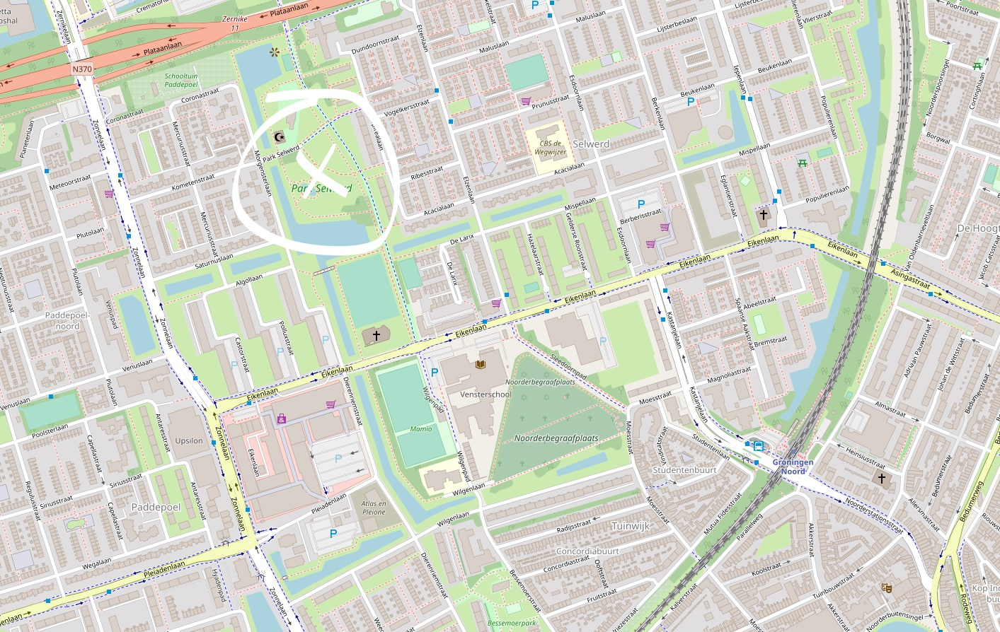

# phd_defense

My PhD defense.

 * Date: September 18, 2020
 * Time: 16:15 to approx 17:15
 * Videostream of defense at [https://www.rug.nl/digitalphd](https://www.rug.nl/digitalphd)
 * Location: De Jonge Onderzoekers, Dirk Huizingastraat 13
 * [My PhD thesis and propositions](https://github.com/richelbilderbeek/thesis)

Time       |What                 
-----------|---------------------
15:00-15:15|Doors are open       
15:15-15:45|Layman talk          
15:45-16:15|Doors are open, break
16:15-17:15|PhD defense          
17:15-18:00|Congratulations      

## Evening program

Beer in Selwerd Park, due to the impossibility of gatherings outside Linnaesbourg 
starting from 20:00,
[here](https://www.openstreetmap.org/note/2353882#map=18/53.23396/6.54775&layers=N):

## Full schedule

This includes different roles

Time       |What                  |Who                  |Where
-----------|----------------------|---------------------|---------------------------------------------
14:00-15:00|Preparation           |Richel and volunteers|DJO
14:30-14:45|Fetch Richel's parents|Paranymphs           |NH Groningen hotel
15:00-15:15|Doors are open        |Everyone             |DJO
15:15-15:45|Layman talk           |Everyone             |DJO
15:45-16:15|Break                 |Guests               |DJO
.          |Preparation           |Richel and paranymphs|DJO
16:15-17:15|PhD defense           |Everyone             |DJO
17:15-18:00|Congratulations       |Everyone             |DJO
18:00-20:00|Family dinner         |Family               |[De Buurvrouw](https://eetcafedebuurvrouw.nl), Oostersingel 152
20:00-??:??|Beer!                 |Adults               |In Selwerd Park, due to the impossibility of gatherings outside Linnaesbourg 

## Maps

### De Jonge Onderzoekers

## Corona 

These are the people involved in the official part.

Name              |Role
------------------|----------
Han Olff          |Chairman
Rampal Etienne    |Promotor
Alex Pigot        |Co-promotor
Daniel Raboski    |Opponent
Ernst Wit         |Opponent
Florian Hartig    |Opponent
Hanno Hildenbrandt|Opponent
Luke Harmon       |Opponent
Thijs Janzen      |Opponent

## Paranymph list

Rank| Name   
----|--------
  1 | Mart   
  2 | Rohan  
  3 | Bruno  
  4 | Maksim 
  5 | Jasper 
  6 | Quinn  
  7 | Jacob  
  8 | Seb    
  9 | Jesper 
 10 | Oliver 

## (NL) Wat doet een paranimf?

Een paranimf is een sjiek gekleed persoon met een plechtige taak,
zoals een bruidsjonker/bruidsmeisje op een bruiloft.
Zie ook [op Wikipedia](https://nl.wikipedia.org/wiki/Paranimf).

Tijdens een promotie zijn er twee paranimfen.

Tijdens de verdediging, zit Richel en de twee paranimfen in
het Aquarium/Fijnmetaallokaal. Daar is een camera, namelijk
die van Richel's laptop. Als een opponent vraagt een stelling ('proposition')
uit het proefschrift voor te lezen, 
gaat Richel uit beeld en mag een paranimf voor de camera een stelling voorlezen.
Daarna mag hij/zij weer uit beeld en Richel in beeld.

Het is onduidelijk of een paranimf volwassen moet zijn. 
Zou je een nep-snor of nep-baard hebben, zou dat niet erg zijn :sunglasses: :+1:.

Het kan zijn dat een paranimf geen stelling voor mag lezen, 
want dat hangt af van de professoren. De eerste stelling
wordt door de eerst gekozen paranimf voorgelezen.
De zeven stellingen kun je [hier](https://github.com/richelbilderbeek/thesis_propositions/blob/master/propositions.tex#L54)
lezen (een paranimf hoeft de stellingen niet te snappen :grin::+1:).

## Beernymphs

 * Alexine
 * Sjors

## Volunteers

 * Bruno: first reserve paranymph, confirmed
 * Jacob: ?
 * Jasper: ?
 * Jesper: ?
 * Jonas: ?
 * Mart: paranymph, confirmed
 * Oliver: ?
 * Quinn: ?
 * Rohan: paranymph, confirmed
 * Seb: ?
 * ?

## (NL) Wat doet een vrijwilliger?

Een vrijwilliger helpt met het opbouwen van de ruimte,
ontvangt de gasten, verzorgt de gasten, geeft rondleidingen op verzoek.

## 8-12 year old guests

 * Rohan (paranymph)
 * Bruno (first reserve paranymph)
 * Maksim (second reserve paranymph)

## 13-17 year old guests

 * Mart (paranymph)
 * Rafayel Gardishyan (guest) (1)
 * Joshua (guest) (2)

## Adult guests

 * Will Bilderbeek (3)
 * Corrie Bilderbeek (4)
 * Nora Migdad (5)
 * Carleen Baarda (6)
 * Jan Kotlarski (7)
 * Kirsten Ferwerda (8)
 * Marco Klinkenberg (9)
 * Bas van Tiggelen (10)
 * Annemieke van Schie (11)
 * Martin Paulussen (12)
 * Kez den Engelsman (13)
 * Gizella (14)

## FAQ

### Am I welcome?

 * For the layman talk: yes, if you are younger than 13 years old 
 * For the ceremony: yes, if you are younger than 13 years old
 * For the evening program: yes, if you are an adult

Due to COVID-19 measures, we allow for a maximum for 14 people that are 13 years or older
or older.

## Misc

 * [My PhD thesis and propositions](https://github.com/richelbilderbeek/thesis)
 * [PhD defense announcement](https://www.rug.nl/about-ug/latest-news/events/promoties/promoties-2020?hfId=118284)
 * [RuG thesis download page](https://www.rug.nl/research/portal/nl/publications/speciation-and-the-error-we-make-in-phylogenetic-inference(95d847f2-8b46-420e-9eb3-2850b828577e).html)

