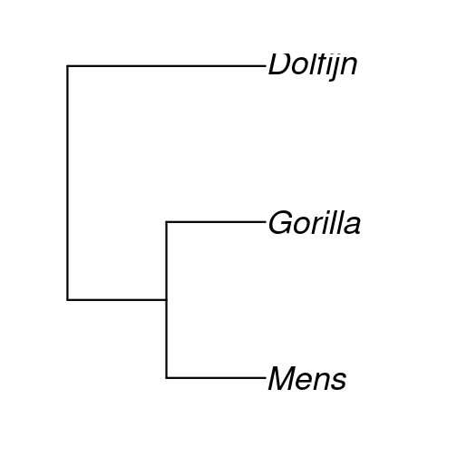

Lekenpraatje
========================================================
author: Richèl J.C. Bilderbeek
date:
autosize: true

Overzicht
========================================================

 * Wat is een lekenpraatje?
 * Wat doet een wetenschapper?
 * Wat is een promotie?
 * Wat heb ik gedaan?

Lekenpraatje
========================================================

Praatje voor 'normale mensen',
die nog niet veel weten van het onderwerp

Wat doet een wetenschapper?
========================================================

 * Experimenten
 * Artikelen schrijven
 * Vertellen

Wat is een promotie?
========================================================

 * Een toneelstuk waarin een boekje met wetenschappelijk
   artikelen plechtig goedgekeurt wordt

Wat heb ik gedaan?
========================================================

 * 'Speciation and the error we make in phylogenetic inference'
 * Soortvorming en de fout die we maken als we fylogenieen maken

***

Hoe maken we een fylogenie?
========================================================

