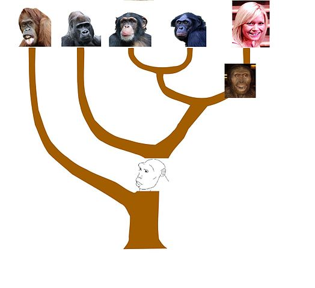

Lekenpraatje
========================================================
author: Richèl J.C. Bilderbeek
date:
autosize: true

Overzicht
========================================================


```r
library(beautier)
library(pirouette)
```

Overzicht
========================================================

 * Wat is een lekenpraatje?
 * Wat doet een wetenschapper?
 * Wat is een promotie?
 * Wat heb ik gedaan?


Lekenpraatje
========================================================

Praatje voor 'normale mensen',
die nog niet veel weten van het onderwerp

Wat doet een wetenschapper?
========================================================

 * Experimenten
 * Artikelen schrijven
 * Vertellen

Wat is een promotie?
========================================================

 * Een toneelstuk waarin een boekje met wetenschappelijk
   artikelen plechtig goedgekeurt wordt

Wat heb ik gedaan?
========================================================

 * 'Speciation and the error we make in phylogenetic inference'
 * Soortvorming en de fout die we maken als we fylogenieen maken

Wat is een fylogenie?
========================================================


Wat is een fylogenie?
========================================================



Wat is een fylogenie?
========================================================


***

 * D = Dolfijn
 * G = Gorilla
 * M = Mens

Waarvan maken we een fylogenie?
========================================================


Waarvan maken we een fylogenie?
========================================================


***

 * DNA

Hoeveel letters heeft DNA?

Waarvan maken we een fylogenie?
========================================================


***

 * DNA
 * 4 lettercode: A, C, G en T

Hoeveel letters heeft een mens?

Waarvan maken we een fylogenie?
========================================================


***

 * DNA
 * 4 lettercode: A, C, G en T
 * Mens: 6 miljard letters

Hoeveel procent verschillen twee mensen?

Waarvan maken we een fylogenie?
========================================================


***

 * DNA
 * 4 lettercode: A, C, G en T
 * Mens: 6 miljard letters
 * Verschil mensen: 0.1%

Hoeveel procent verschillen een mens en een gorilla?

Waarvan maken we een fylogenie?
========================================================


***

 * DNA
 * 4 lettercode: A, C, G en T
 * Mens: 6 miljard letters
 * Verschil mensen: 0.1%
 * Verschil mens-aap: 1.1%


Hoe maken we een fylogenie?
========================================================


```
>M
AAAGAGAAAAAAAAAAATAAAAAAAAAAAAAACAAACTAT
>G
AATAAACAAAAAAATTAAAAAAAAAAAAAAAAAATTCTAA
>D
ATTGAAAAAAAATAGACTACAACCACATAGCACAAGAAAC
```

Hoe maken we een fylogenie?
========================================================


Hoe maken we een fylogenie?
========================================================


De fout die we maken als we fylogenieen maken
========================================================


***


De fout die we maken als we fylogenieen maken
========================================================


Soortvorming
========================================================


Soortvorming
========================================================


***


Soortvorming
========================================================


***


Soortvorming
========================================================


***


Soortvorming: model 1
========================================================


Soortvorming: model 1
========================================================


***

Dit is een hele rare ...

Soortvorming: model 2
========================================================


***

 * Snelheid blijft gelijk
 * Heel snel heel veel soorten

Soortvorming: model 3
========================================================


***

 * Snelheid afhankelijk van het aantal soorten
 * Er is een maximaal hoeveelheid aantal soorten

Soortvorming en de fout die we maken als we fylogenieen maken
========================================================

# Maakt het model uit voor fylogenieen?


